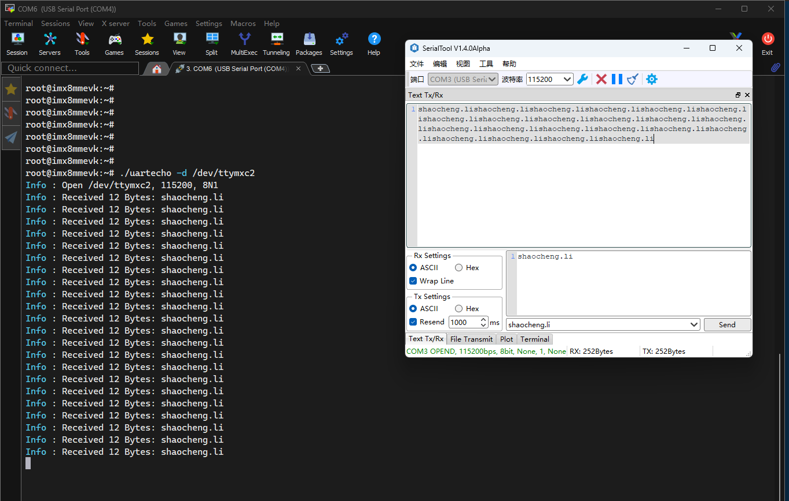
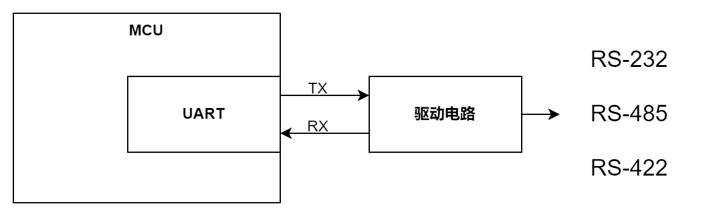

# libuartdev

## 基本用法

- src 和 include 下是链接库的源码和头文件。
- example 下是调用链接库的例程。

执行 `./build.sh` 会自动编译生成 Debug 和 Release 两个版本，生成的链接库和可执行文件位于 Debug/Release 下的 output 目录下。可以执行 `cmake --install Release` 命令，将 Release 版本的动态库和头文件安装到 `/usr/local/` 下的 lib 和 include 目录下。可以用 `--prefix` 选项改变安装路径，例如 `cmake --install Release --prefix ./install` 。

如果是交叉编译，可以用 `${CC}` 环境变量设置交叉编译工具链，可以将脚本里的 `enable_download` 设为 1 ，编译后自动下载到目标板的相应目录。

例程 uartecho 的作用是接收串口数据再发回去，语法：

```
> ./uartecho -h
Usage:
  uartecho  [option]
Option:
  -d   serial port , default /dev/ttyS0
  -b   baud rate , default 115200
  -p   parity , O/o , E/e or N/n , default N
  -x   data bit , 7 or 8 ,defalut 8
  -z   stop bit , 1 or 2 ,default 1
  -v   output more infomation
  -h   help
```

例如：



## 串口与终端

这里所说的串口（Serial port），是指异步串行通讯接口（RS-232等），这是一种非常古老的接口标准，1960 年由美国电子工业联盟（EIA）制定， 用于电传打字机与计算机的连接。

当时计算机才发明出来不久，面临人机交互的问题，而电传打字机已经存在很久，用于收发电报：

- 将接收到的电信号转化为机械运动驱动打印机将字母打印到纸上。
- 将在键盘上的输入信号编码转换为电信号发送出去。

于是，将电传打字机与计算机用专用电缆（例如 RS-232 ）连接起来，成为了计算机的终端（Terminal），用于计算机的输入和输出。电传打字机的英文是 [Teletype](https://en.wikipedia.org/wiki/Teletype_Corporation) ，这是也是一家公司的名字，因为生产电传打印机太出名，从而成为代名词。在类 Unix 系统中，tty 就是此单词的缩写。其中最著名的是 [Teletype Model 33](https://en.wikipedia.org/wiki/Teletype_Model_33#Historical_impact)，历史影响颇深。下面是用 Teletype Model 33 连接 PiDP-11 计算机的视频：

[](https://www.youtube.com/watch?v=DRzpJyOc3bc)

后来，随着 CRT 显示器的发明，终端（Terminal）功能逐步变成了由一种叫做虚拟终端的软件实现，电传打字机退出了历史舞台，但是它的很多特性对类 Unix 操作系统的影响一直持续至今，例如：

- 终端的设备文件叫做 tty ，就是一种虚拟终端。
- 逐行依次输出文本，因为电传打字机是无法修改已经打印到纸上的字符的。
- 各种 shell 都提供命令提示符，用来区分需要区分用户的输入和机器的输出，因为电传打字机是黑白，只能通过命令提示符来区分。
- 回车和换行符是两个，因为电传打字机切换行时是需要先将打字头回到开头，然后纸筒滚动一行。
- 由于电传打字机的键盘是计算机的唯一的输入端，因此通过 ctrl 加字符打印出一些特殊字符，以给正在运行程序发送信号。
- 多数库函数的打印日志均采用 print 单词，原因在于，在当时看，就是物理意义上打印到纸上。

但是串口并没有消失，很多嵌入式设备，依然使用串口作为调试终端，还衍生出其他电平标准用于不同的场合。现在串口的硬件基本结构：



[UART](https://en.wikipedia.org/wiki/Universal_asynchronous_receiver-transmitter) 全称通用异步收发器（universal asynchronous receiver-transmitter），是大部分芯片上实现串口的硬件电路，它对外有两个信号引脚（RX是收，TX是发），都是TTL电平（ 0V 表示逻辑 0 ，5V 表示逻辑 1 ），这个信号就叫 TTL 串口，用于短距离内通讯，如果要应对其他情况，需要用外部的驱动电路进行电平转换，从而形成今天常用的三种串口标准：

- RS-232，单端信号全双工，有 RX 和 TX 两个信号，可以同时收发。+3 ~ +15 V 表示逻辑 0 ，−15 to −3 V 表示逻辑 1 。
- RS-485，差分信号半双工，有 A 和 B 两个信号（有时也叫做 D+/D-），同一时间只能接收或者发送，A 电压低于 B 电压表示逻辑 1 ，A 电压高于 B 电压表示逻辑 0 。
- RS-422，差分信号全双工，有两组 A/B 信号，一组负责收（Rx+/Rx-），一组负责发（Tx+/Tx-），相当于两路 RS-485 。

无论哪种串口，UART 帧协议都是一样的，由 5 个元素组成：
- Idle ，用逻辑 1 表示空闲无数据，是数据帧之间的间隔。
- Start bit，起始位，在数据帧开始前，将电平拉低为逻辑 0 ，保持一个周期。
- Data bits，之后的 5~8 个周期是数据位，也就是一个 UART 帧可以传输 5~8 bits 。
- Parity bit，如果使用奇偶校验位，它将被放置在所有数据位之后，判断数据在传输过程中是否发生变化
- Stop bit，最后是停止位，将电平拉高到逻辑 1 ，保持 1~2 个周期。 

下面是 8 个数据位，无奇偶校验，2 个停止位的一帧时序图：


第二行是时钟周期，因为串口是异步通讯，所以没有时钟信号，需要通讯双方约定通讯速率，这个叫做波特率，单位是 bits/s ，例如波特率 115200 ，表示每秒发送 115200 bits，那么一个周期就是 （1000000us/115200）。 

## 串口编程

在 Linux 下使用 C 语言进行串口编程，通常是调用 [GNU C Library](https://www.gnu.org/software/libc/) 提供的 [Low-Level Terminal Interface](https://www.gnu.org/software/libc/manual/html_node/Low_002dLevel-Terminal-Interface.html?spm=wolai.workspace.0.0.7bf85fdcxzdAL7)。核心是使用 `struct termios` 结构设置串口的各种属性：

```
struct termios
  {
    tcflag_t c_iflag;       /* input mode flags */
    tcflag_t c_oflag;       /* output mode flags */
    tcflag_t c_cflag;       /* control mode flags */
    tcflag_t c_lflag;       /* local mode flags */
    cc_t c_line;            /* line discipline */
    cc_t c_cc[NCCS];        /* control characters */
    speed_t c_ispeed;       /* input speed */
    speed_t c_ospeed;       /* output speed */
  };

// 获取属性
int tcgetattr (int filedes, struct termios *termios-p)
// 设置属性
int tcsetattr (int filedes, int when, const struct termios *termios-p)
```

类 Unix 系统的串口编程支持两种基本的输入模式：规范模式和非规范模式：

- 规范模式也叫行模式，接收数据是以换行符（'\n'）、EOF或EOL字符结束的行进行处理，在用户输入完整行之前，无法读取任何输入，并且 read 函数最多返回一行输入，无论请求多少字节。并且可以根据一些特殊字符控制输入行为。主要用于虚拟终端。
- 非规范模式也叫做 Raw 模式，接收数据不被分组，read 函数请求任意长度的数据，可以用 VMIN 和 VTIME 控制接收细粒度。主要用于设备之间的数据通讯。

## License

Copyright (C) 2024 Lishaocheng <https://shaocheng.li> 

This program is free software; you can redistribute it and/or modify it under the terms of the GNU Lesser General Public License version 3 as published by the Free Software Foundation.
